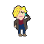

  

# Instructions

Use `A` and `D` to move left and right. `W` to jump. Your goal it to collect 15
toilet paper rolls without getting infected. Every time you come in contact
with a customer, you lose a life and your mask strength is decreased. Beware the
other customers: they're not as concerned about social distancing as you are.
Once you lose all protection and get infected, it's game over.

    

        
    

    

        
    

    

        
    

# Installation

If you'd like to play from source or trying customizing the game yourself, you
have to [install Python](https://www.python.org/downloads/) and
[pip](https://pip.pypa.io/en/stable/installing/). Then download this repository
by clicking the green button above that says "Code." Once you've got the
repository, open a terminal and run `pip install -r requirements.txt`. Then,
run `python main.py`.
